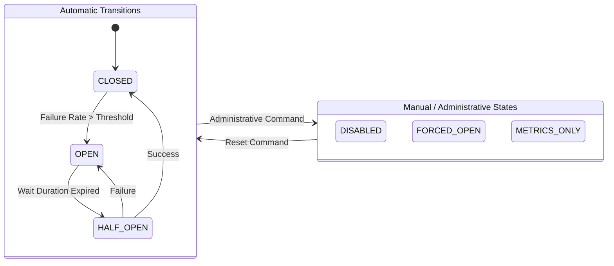

# Isolated Resilience4j CircuitBreaker for Formal Verification

This directory contains a minimal, isolated version of the `CircuitBreakerStateMachine` from the Resilience4j library, intended for formal verification using JBMC.

## Directory Structure

*   **`src/`**: Contains the source code.
    *   `io/github/resilience4j/circuitbreaker`: The core CircuitBreaker logic.
    *   `io/github/resilience4j/core`: Essential dependencies (metrics, functional interfaces, etc.).
    *   `org/slf4j`: Stub implementations of SLF4J Logger to avoid external dependencies.
    *   `javax/annotation`: Stub implementations of JSR-305 annotations.
*   **`compile.sh`**: A script to compile the source code.
*   **`classes/`**: The output directory for compiled class files (generated by `compile.sh`).

## How to Compile

Run the compilation script:

```bash
./compile.sh
```

This will compile all Java files in `src/` and place the class files in `classes/`.

## Dependencies

This project has **zero external dependencies**.
*   Logging (SLF4J) is stubbed.
*   Annotations (JSR-305) are stubbed.
*   It requires only a standard JDK (Java 8+) to build.

---

# Resilience4j & CircuitBreakerStateMachine Explained

## 1. What is Resilience4j?

**Resilience4j** is a lightweight fault tolerance library designed for Java.

In a distributed system (like microservices), services often call each other. If one service fails (e.g., the Database Service is down), you don't want that failure to cascade and take down your entire application (e.g., the Order Service waiting forever for the Database).

Resilience4j provides patterns to handle these failures gracefully. The most famous pattern is the **Circuit Breaker**.

## 2. The Circuit Breaker Pattern

Think of it exactly like the electrical circuit breaker in your house.

*   **Normal Operation (CLOSED)**: Electricity flows freely. If you turn on a switch, the light turns on.
*   **Fault (Overload)**: If there's a short circuit or too much load, the breaker "trips" and opens the circuit.
*   **Protection (OPEN)**: Now, electricity *cannot* flow. This prevents the wires from melting or catching fire.
*   **Recovery (HALF_OPEN)**: After a while, you flip the switch back to see if it works. If it does, everything is back to normal. If it pops again, you wait longer.

In software:
*   **Electricity** = Requests/Calls to a backend service.
*   **Tripping** = Too many errors or timeouts.
*   **Protection** = Stop sending requests to the failing service immediately (fail fast) so it has time to recover.

### Visual State Diagram



*Note: The states `DISABLED`, `FORCED_OPEN`, and `METRICS_ONLY` are not part of the normal failure handling cycle. They are entered only via manual administrative commands (e.g., by an operator or a management script).*

## 3. Deep Dive: CircuitBreakerStateMachine

The `CircuitBreakerStateMachine` class is the "brain" of the Circuit Breaker in Resilience4j. It decides which state the system is in and whether to allow a request to pass through.

### Core Concept: Finite State Machine (FSM)

It implements a **Finite State Machine**. It has a specific set of states and rules for moving between them.

### The States (Inner Classes)

The code uses the **State Pattern**. Instead of one giant `if-else` block, each state is a separate inner class that implements the behavior.

#### 1. CLOSED (The Happy Path)
*   **Class**: `ClosedState`
*   **Behavior**:
    *   `tryAcquirePermission()` returns `true`. All requests are allowed.
    *   It tracks metrics (successes vs. failures).
*   **Transition**:
    *   If the failure rate (or slow call rate) exceeds the configured threshold (e.g., > 50% failure), it transitions to **OPEN**.

#### 2. OPEN (The Protection Mode)
*   **Class**: `OpenState`
*   **Behavior**:
    *   `tryAcquirePermission()` returns `false`. Requests are blocked immediately (throwing a `CallNotPermittedException`).
    *   This gives the failing backend system time to recover without being hammered by requests.
*   **Transition**:
    *   It sets a timer (wait duration).
    *   Once the time is up, it automatically (or lazily) transitions to **HALF_OPEN**.

#### 3. HALF_OPEN (The Testing Mode)
*   **Class**: `HalfOpenState`
*   **Behavior**:
    *   It allows a limited number of "probe" requests to pass through (e.g., 10 calls).
    *   The rest are still blocked.
*   **Transition**:
    *   **Success**: If these probe calls succeed, the backend is healthy! Transition back to **CLOSED**.
    *   **Failure**: If they fail, the backend is still broken. Transition back to **OPEN** and wait again.

### Other States

#### 4. DISABLED (Always Allow)
*   **Behavior**: The circuit breaker is effectively turned off. It allows **all** calls to pass through.
*   **Metrics**: **NO**. It does *not* track success or failure metrics. `onError` and `onSuccess` are no-ops.
*   **Use Case**: Debugging, or if you want to temporarily disable the circuit breaker without deploying new code.

#### 5. FORCED_OPEN (Always Block)
*   **Behavior**: The circuit breaker is manually forced open. It blocks **all** calls.
*   **Metrics**: **NO**. Since calls are blocked, no business logic is executed, so there are no success/failure metrics to record. However, it *does* record that a call was rejected.
*   **Use Case**: If you know an external service is down (e.g., maintenance) and you want to stop all traffic immediately.

#### 6. METRICS_ONLY (Spy Mode)
*   **Behavior**: It allows **all** calls to pass through (like CLOSED).
*   **Metrics**: **YES**. It tracks success and failure metrics exactly like the CLOSED state.
*   **Transition**: It **NEVER** trips to OPEN, even if the failure rate exceeds the threshold. It just logs/publishes the event.
*   **Use Case**: "Shadow mode". You can use this to test your configuration (e.g., "Would my 50% threshold be too sensitive?") in production without actually breaking the circuit.

### Key Methods in `CircuitBreakerStateMachine`

*   **`tryAcquirePermission()`**:
    *   This is the gatekeeper. Before your code calls the external service, it asks the state machine: "Can I go?"
    *   If **CLOSED**: "Yes."
    *   If **OPEN**: "No."
    *   If **HALF_OPEN**: "Maybe (if you are one of the lucky probes)."

*   **`onSuccess()` / `onError()`**:
    *   After your call finishes, you report back to the state machine.
    *   "It worked!" -> The machine updates metrics.
    *   "It failed!" -> The machine updates metrics and checks if it needs to trip the breaker.

*   **`stateTransition(State newState)`**:
    *   Handles the atomic switch from one state to another, ensuring thread safety so two threads don't mess up the state.

## 4. Verification Properties

If you are formally verifying this class (e.g., using JBMC), here is a categorized list of properties you should verify.

### A. Safety Properties (Bad things never happen)
*These ensure the system doesn't enter an invalid state or allow calls when it shouldn't.*

1.  **No Illegal Transitions**:
    *   `CLOSED` state can **NEVER** transition directly to `HALF_OPEN`.
    *   `OPEN` state can **NEVER** transition directly to `CLOSED`.
2.  **Open State Protection**:
    *   When in `OPEN` state, `tryAcquirePermission()` MUST return `false` (unless the wait duration has expired).
3.  **Half-Open Limits**:
    *   When in `HALF_OPEN` state, the number of permitted calls MUST NOT exceed the configured limit (e.g., `permittedNumberOfCallsInHalfOpenState`).

### B. Liveness Properties (Good things eventually happen)
*These ensure the system doesn't get stuck.*

1.  **Recovery from Open**:
    *   If the system is in `OPEN` state AND the wait duration has expired, the next call to `tryAcquirePermission()` MUST transition the state to `HALF_OPEN`.
2.  **Recovery from Half-Open**:
    *   If the system is in `HALF_OPEN` state AND all permitted calls succeed, it MUST transition to `CLOSED`.

### C. Functional Correctness (It does what it says)
*These verify the core business logic.*

1.  **Failure Threshold Logic**:
    *   If in `CLOSED` state AND the failure rate exceeds the threshold (e.g., 50%), it MUST transition to `OPEN`.
    *   If in `CLOSED` state AND the failure rate is below the threshold, it MUST stay in `CLOSED`.
2.  **Half-Open Failure Logic**:
    *   If in `HALF_OPEN` state AND *any* call fails (or the failure rate of the probe calls exceeds the threshold), it MUST transition back to `OPEN`.
3.  **Metric Accuracy**:
    *   `onSuccess` MUST increment the success count.
    *   `onError` MUST increment the failure count.
